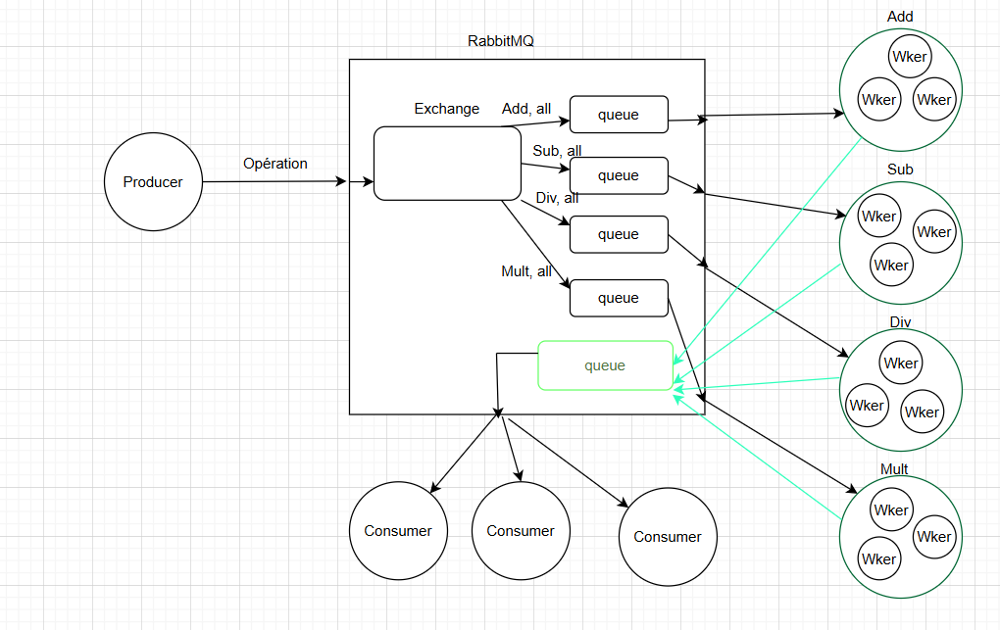

# 🧮 Calculateur Distribué avec RabbitMQ

Un système de calcul distribué basé sur **RabbitMQ**, conçu pour l’**Institut de Physique Nucléaire NGI**.  
Le système répartit des opérations mathématiques (`add`, `sub`, `mul`, `div`) entre plusieurs workers.

---

## 🎯 Objectif

Simuler un système distribué de calcul mathématique utilisant **RabbitMQ** comme message broker.  
Un producteur envoie des opérations aléatoires, réparties entre des workers via RabbitMQ, et les résultats sont collectés par un consommateur dédié.

---

## 🧰 Technologies utilisées

- 🟢 Node.js & Express
- 🐇 RabbitMQ (via Docker)
- 📦 [amqplib](https://www.npmjs.com/package/amqplib)
- 🐳 Docker & Docker Compose

---

## 🧠 Schéma de l’architecture



---

## 📁 Structure du projet

```
exo_rabbitMQ/
├── docker-compose.yml        # Définition du service RabbitMQ
├── package.json              # Scripts et dépendances
├── README.md                 # Documentation du projet
├── schema.png                # Schéma de l'architecture

├── producer.js               # Envoie des opérations aléatoires (add, sub, mul, div, all)
├── result_consumer.js        # Lit et affiche les résultats des calculs
├── server.js                 # Serveur HTTP simple
└── workers/
    ├── worker_add.js         # Worker gérant les additions
    ├── worker_sub.js         # Worker gérant les soustractions
    ├── worker_mul.js         # Worker gérant les multiplications
    └── worker_div.js         # Worker gérant les divisions
```

---

## ⚙️ Prérequis

- 📦 Node.js ≥ 16
- 🐳 Docker ≥ 20
- 🐳 Docker Compose ≥ 1.29
- 🐇 RabbitMQ (via Docker ou installation locale)

---

## 🚀 Installation & Exécution

### 1. Cloner le dépôt

```bash
git clone https://github.com/dktmody/exo_rabbitMQ.git
cd exo_rabbitMQ
```

### 2. Installer les dépendances Node.js

```bash
npm install
```

### 3. Lancer RabbitMQ avec Docker

```bash
docker-compose up -d
```

### 4. Vérifier le lancement de RabbitMQ

- AMQP: `amqp://localhost:5672`
- Interface de gestion (optionnel) :  
  🔗 [http://localhost:15672](http://localhost:15672) (login ci-dessous)

**Identifiants de connexion :**

- **Login** : `user`
- **Mot de passe** : `password`

---

## 🖥️ Lancement des composants

### 5. Lancer les workers puis le serveur backend et enfin le consommateur

Dans un terminal :

```bash
node workers/index_worker.js
```
Puis :
```bash
node result_consumer.js
```
Et enfin:
```bash
node server.js
```

### 6. Producteur d’opérations

- Mode aléatoire (nombres et opération aléatoires) :

```bash
node producer.js
```

- Mode manuel (ex: addition 5 + 2) :

```bash
node producer.js 5 2 add
```

- Toutes les opérations (add, sub, mul, div) :

```bash
node producer.js 5 2 all
```
- Les opérations (add, sub, mul, div, all) peuvent également s'effectuer sur le navigateur  :

Pour plus d'infos voir la partie Notes complémentaires

---

## ✅ Résultat attendu

- Les workers reçoivent les opérations correspondant à leur type (add, sub, etc.).
- Chaque worker effectue le calcul et envoie le résultat à une file dédiée.
- Le consommateur lit les résultats et les affiche dans le terminal.

---

## 📬 Notes complémentaires

- Vous pouvez observer la file et les échanges dans l’interface RabbitMQ (http://localhost:15672).

- Pour le test sur le navigateur, ouvrir fichier index.html en local avec live server par exemple (http://127.0.0.1:5500/index.html)
---

## 🧑‍🔬 Projet réalisé dans le cadre d’un TP pour la matière RabbitMQ
